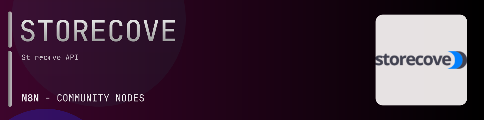

# @n8n-dev/n8n-nodes-storecove



[](https://www.npmjs.com/package/@n8n-dev/n8n-nodes-storecove)
[](https://opensource.org/licenses/MIT)

---

**Stop writing storecove API integrations by hand.**

Every time you connect n8n to storecove, you waste hours mapping endpoints, defining parameters, and debugging schemas. You copy-paste from docs, fix edge cases, and pray nothing breaks.

**What if connecting n8n to storecove took 5 minutes, not half a day?**

This node gives you **10+ resources** out of the box: **Invoice Submissions**, **Document Submissions**, **Legal Entities**, **Peppol Identifiers**, **Administrations**, and 5 more: with full CRUD operations, typed parameters, and zero manual configuration.

---

## What You Get

- **Zero boilerplate**: Resources, operations, and fields are pre-configured and ready to use
- **Full CRUD**: Create, read, update, and delete support where the API allows it
- **Typed parameters**: No more guessing field types
- **Built-in auth**: API key authentication, ready to go
- **Declarative**: Native n8n performance, no custom execute() overhead

---

## Install

```bash
npm install @n8n-dev/n8n-nodes-storecove
```

**Or in n8n:**
1. **Settings → Community Nodes → Install**
2. Search: `@n8n-dev/n8n-nodes-storecove`
3. Click **Install**

---

## Quick Start

1. Install the node (above)
2. Add credentials: **storecove API** → paste your API key
3. Drag the **storecove** node into your workflow
4. Pick a resource → pick an operation → done.

That's it. No configuration files. No code. It just works.

---

## Resources

| Resource | Operations |
|----------|------------|
| Invoice Submissions | Post submit a new invoice, Post deprecated preflight an invoice recipient, Get deprecated get invoicesubmission evidence |
| Document Submissions | Post submit a new document, Get documentsubmission evidence |
| Legal Entities | Post create a new legalentity, Delete legalentity, Get legalentity, Patch update legalentity |
| Peppol Identifiers | Post create a new peppolidentifier, Delete peppolidentifier |
| Administrations | Post create a new administration, Delete administration, Get administration, Patch update administration |
| Received Documents | Post receive a new document, Post create a new received document, Get a new receiveddocument |
| Additional Tax Identifiers | Post create a new additionaltaxidentifier, Delete additionaltaxidentifier, Get additionaltaxidentifier, Patch update additionaltaxidentifier |
| Purchase Invoices | Get purchase invoice data as json, Get purchase invoice data in a selectable format, Get purchase invoice data as json with a base64encoded ubl string in the specified version |
| Webhook Instances | Get a webhookinstance, Delete a webhookinstance |
| Discovery | Post discover network participant existence, Get discover country identifiers  experimental, Post disover network participant |

---

## Why This Node?

**Without this node:**
- Hours of manual API integration
- Copy-pasting from storecove docs
- Debugging auth, pagination, error handling
- Maintaining your own client code

**With this node:**
- Install → configure → use. 5 minutes.
- Auto-generated from the official storecove OpenAPI spec
- Always up to date when the API changes
- Native n8n performance

---

## Auto-Generated
This node was auto-generated from the official **storecove** OpenAPI specification using
[@n8n-dev/n8n-openapi-node-ultimate](https://github.com/kelvinzer0/n8n-openapi-node-ultimate),
then validated against the live API so you get accurate types and real parameters, not guesswork.

When the storecove API updates, this node updates too.

---

## Support This Project

If this node saved you hours of work, consider supporting continued development, new APIs, better error handling, and faster updates.

[](https://n8n-code.github.io/membership/#/eyJ0aXRsZSI6IktlZXAgSXQgTW92aW5nIiwiZGVzYyI6Ik9uZSBkZXZlbG9wZXIgYnVpbHQgYSB0b29sIHRoYXQgYXV0by1nZW5lcmF0ZXNcbm44biBub2RlcyBmcm9tIGFueSBPcGVuQVBJIHNwZWMuXG5cbllvdXIgZG9uYXRpb24gZnVuZHMgbmV3IGZlYXR1cmVzLCBtb3JlIEFQSSBzdXBwb3J0LFxuYW5kIGJldHRlciB0b29saW5nIGZvciBldmVyeSBkZXZlbG9wZXIgYWZ0ZXIgeW91LiIsInRhcmdldCI6NTAwMCwiYWRkcmVzc2VzIjp7ImV0aGVyZXVtIjoiMHhmMDU1NWQ0MGRiRkI0ZTNCZjA3MDQ0MjgyQjc4RjJmRTFmNTFFZjcyIiwic29sYW5hIjoiNlpEVk5BYmpZZExEcXo4cGt3VUNHYllaNVV3QlFranB0QzU1Wk5vTFcybVUifSwiZGlzY29yZCI6Imh0dHBzOi8vZGlzY29yZC5nZy9wdERaOGU0aDkzIn0)

---

## License

MIT © [kelvinzer0](https://github.com/n8n-code)
